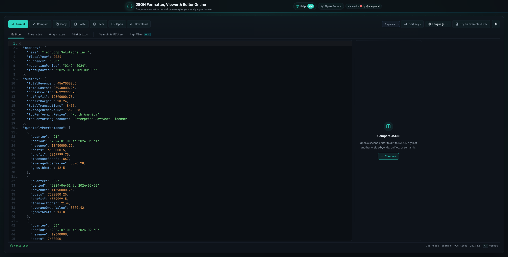
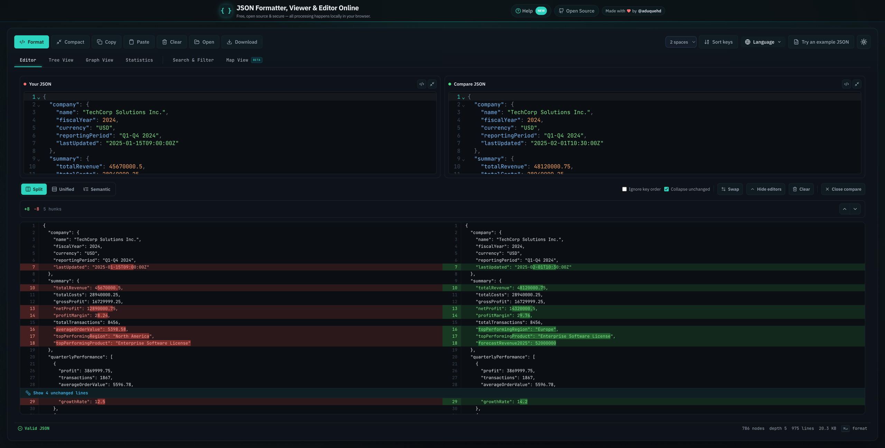
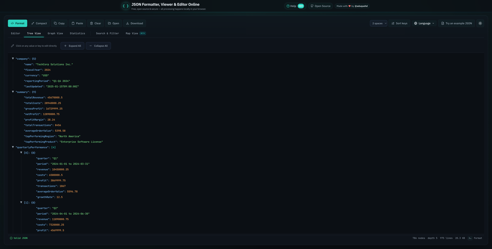
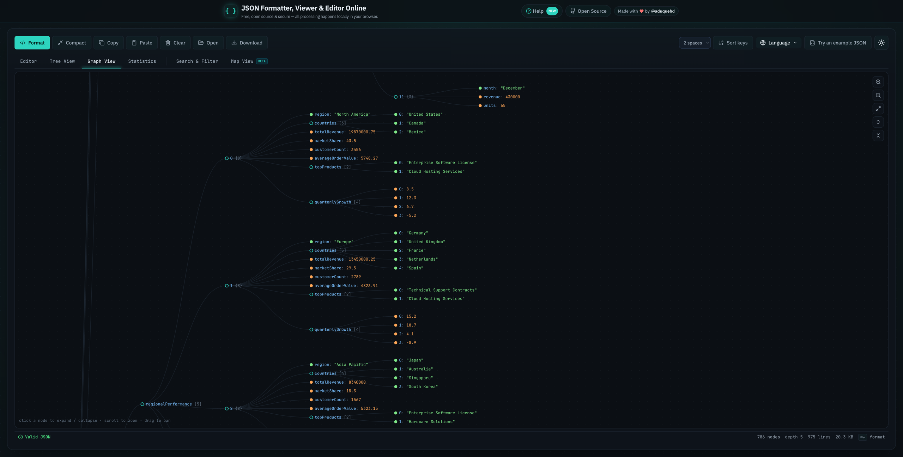

<div align="center">
  <h1>🎨 JSON Viewer</h1>
  <p>
    <strong>A modern, privacy-first web app to format, validate, explore, and compare JSON — with a VS Code-style editor and rich visualizations</strong>
  </p>

  <!-- Badges -->
  <p>
    <a href="https://www.jsonformatter.me/">
      
    </a>
   </p>
   <p>
    
    
    
    
    
  </p>
</div>

---

## ✨ Features

### Editing & Formatting
- 📝 **CodeMirror 6 Editor**: VS Code-style editing with syntax highlighting, line numbers, and code folding
- 🎯 **JSON Formatting**: Format with 2 spaces, 4 spaces, or tabs — plus optional A→Z key sorting
- ✅ **Real-time Validation**: Live validation with inline error highlighting and a status bar (nodes, depth, lines, size)
- 🔧 **JSON Auto-fix**: Automatic correction of common errors — trailing commas, single quotes, unquoted keys, missing commas
- 🏷️ **JavaScript Object Literal Support**: Parse and format JS object literal syntax
- 📋 **Clipboard & Files**: Copy, paste, open/drag-in `.json` files, and download the result

### Visualization & Analysis
- 🌳 **Tree View**: Interactive collapsible tree with inline editing of keys and values
- 📊 **Graph View**: Explore JSON as an interactive node-link graph (D3.js) with pan, zoom, and expand/collapse
- 🔀 **Compare / Diff**: Side-by-side compare with **split, unified, and semantic** modes, "ignore key order", collapse-unchanged, and hunk navigation
- 📈 **Statistics View**: Key counts, nesting depth, and a full data-type breakdown
- 🔍 **Search & Filter**: Find keys and values across large documents
- 🗺️ **Map View** (beta): Plot latitude/longitude data on an interactive Leaflet map

### App & Platform
- 🌐 **Internationalization**: UI translated into 12 languages (English, Spanish, Hindi, Turkish, Dutch, Malay, Chinese, Tamil, and more)
- 🎨 **Theme Support**: Light and dark themes with system-preference detection
- 🔗 **A Real URL per View**: `/`, `/tree`, `/graph`, `/stats`, `/diff`, `/search`, `/map` — reloadable, shareable, and indexable, while the workbench keeps your JSON when switching views
- 📚 **Guides & Help**: Built-in JSON guides (syntax, common errors, JSON vs XML, `JSON.parse`, and more) at `/guides` and a help page at `/help`
- 📱 **Responsive UI**: Works on desktop and mobile
- 🔒 **100% Local Processing**: Everything runs in your browser — no JSON is ever sent to a server

## 📸 Screenshots

Taken with the built-in **"Try an example JSON" → Financial Sales** dataset.

### Editor
The main editor with formatting toolbar, validation status bar, and the Compare panel ready to open.



### Compare / Diff
Two documents compared side by side — changed lines highlighted, with split/unified/semantic modes and hunk navigation.



### Tree View
Collapsible tree with inline editing — click any key or value to edit it directly.



### Graph View
JSON as an interactive node-link graph — click nodes to expand/collapse, scroll to zoom, drag to pan.



## 📋 Requirements

- 📦 Node.js 18.18 or later (20+ recommended)
- 🚀 pnpm (primary package manager)

## 🚀 Quick Start

1. Clone the repository:
   ```bash
   git clone https://github.com/aduquehd/json-viewer.git
   cd json-viewer
   ```

2. Install dependencies:
   ```bash
   pnpm install
   ```
   (This also installs the Lefthook git hooks.)

3. Run the development server (Turbopack):
   ```bash
   pnpm dev
   ```

4. Open your browser and go to `http://localhost:3000`

## 💻 Development

### 🛠️ Available Scripts

```bash
pnpm dev         # Development server with Turbopack
pnpm build       # Production build
pnpm start       # Start production server

pnpm format      # Format code (Biome)
pnpm fix         # Auto-fix formatting + safe lint issues + organize imports (Biome)
pnpm lint        # Lint Next.js framework rules (ESLint)
pnpm lint:biome  # General JS/TS linting (Biome)
pnpm typecheck   # Type-check the whole project (tsc --noEmit)
pnpm check       # Run every validation at once (Biome + ESLint + tsc)
```

### 🎨 Code Quality

The repo uses a **hybrid lint/format setup**:

- **Biome** owns formatting, general JS/TS linting, and import organization (single quotes, 2-space indent, 100 print width)
- **ESLint** (flat config) runs only the Next.js layer: `next/core-web-vitals` (React Hooks, `next/image`, jsx-a11y)
- **TypeScript** strict mode with `tsc --noEmit` for type safety

### 🪝 Git Hooks (Lefthook)

A pre-commit hook (installed automatically on `pnpm install`) runs, in order:

1. Biome — formats/lints/organizes imports on staged files (auto-fixes and re-stages)
2. ESLint — checks staged JS/TS files against the Next.js rules
3. `tsc --noEmit` — type-checks the project when a TS file is staged

Bypass once with `git commit --no-verify` if needed.

## 📂 Project Structure

```
json-viewer/
├── 📁 docs/
│   └── 📁 screenshots/            # README screenshots
├── 📁 public/                     # Static assets (manifest, robots.txt, images)
├── 📁 src/
│   ├── 📁 app/                    # Next.js App Router
│   │   ├── 📁 (app)/              # Workbench views — one URL per view
│   │   │   ├── 📄 page.tsx        #   /        Editor / formatter
│   │   │   ├── 📄 tree/           #   /tree    Tree view
│   │   │   ├── 📄 graph/          #   /graph   Graph view
│   │   │   ├── 📄 stats/          #   /stats   Statistics
│   │   │   ├── 📄 diff/           #   /diff    Compare / diff
│   │   │   ├── 📄 search/         #   /search  Search & filter
│   │   │   ├── 📄 map/            #   /map     Map view
│   │   │   └── 📄 layout.tsx      #   Shared shell — keeps editor state across views
│   │   ├── 📁 api/sitemap/        # Dynamic sitemap (rewritten from /sitemap.xml)
│   │   ├── 📁 guides/             # JSON guides (what is JSON, syntax, errors, JSON vs XML, …)
│   │   ├── 📁 help/               # Help & documentation page
│   │   ├── 🎨 globals.css         # Global styles and CSS theme variables
│   │   └── 📄 layout.tsx          # Root layout with metadata
│   ├── 📁 components/             # React components
│   │   ├── 📝 CodeMirrorEditor.tsx    # CodeMirror 6 integration
│   │   ├── 🖥️ EditorWorkspace.tsx     # Editor layout + Compare call-to-action
│   │   ├── 🔀 CompareWorkspace.tsx    # Diff: split / unified / semantic modes
│   │   ├── 🧰 JsonWorkbench.tsx       # Central state manager for all views
│   │   ├── 🌳 TreeView.tsx            # Interactive JSON tree
│   │   ├── 📊 GraphView.tsx           # D3.js node-link visualization
│   │   ├── 📈 StatsView.tsx           # JSON statistics analysis
│   │   ├── 🔍 SearchView.tsx          # Search & filter
│   │   ├── 🗺️ MapView.tsx             # Leaflet geographic visualization
│   │   ├── 🎛️ ControlButtons.tsx      # Format / Compact / Copy / Open / Download controls
│   │   ├── 📑 TabsContainer.tsx       # View tabs (synced with the URL)
│   │   ├── 📟 StatusBar.tsx           # Validity, node count, depth, size
│   │   ├── 🌐 LanguageSelector.tsx    # 12-language switcher
│   │   ├── 🌓 ThemeProvider.tsx       # Theme management
│   │   ├── 📚 JsonExampleModal.tsx    # Sample JSON picker
│   │   └── 📁 seo/                    # Per-view SEO content (FAQs, HowTo, JSON-LD)
│   ├── 📁 hooks/                  # useTheme, useNotification
│   ├── 📁 lib/                    # i18n setup, per-view SEO/routing metadata, gtag
│   ├── 📁 locales/                # Translations (12 languages)
│   ├── 📁 types/                  # Global TypeScript declarations
│   └── 📁 utils/                  # jsonFixer, jsonUtils, jsonDiff, exampleData
├── ⚙️ biome.json                  # Biome formatter/linter config
├── ⚙️ eslint.config.mjs           # ESLint flat config (Next.js rules only)
├── 🪝 lefthook.yml                # Pre-commit hooks
├── 🚀 next.config.js              # Security headers, redirects, sitemap rewrite
├── 🎨 tailwind.config.js          # Tailwind CSS configuration
└── ⚙️ tsconfig.json               # TypeScript configuration (strict, @/* alias)
```

## 🛠️ Technology Stack

### Framework


Next.js 16 (App Router, Turbopack dev server), React 19, TypeScript in strict mode.

### Styling & UI


Tailwind CSS with CSS custom properties for theming, Framer Motion animations, Lucide icons, Notyf toasts.

### Editor & Visualizations


CodeMirror 6 for the JSON editors, D3.js for the force-directed graph, Leaflet + react-leaflet for maps.

### Internationalization

i18next + react-i18next with browser language detection — 12 supported languages.

### Development Tools


pnpm, Biome, ESLint 9 (flat config), Lefthook git hooks, deployed on Vercel.

## 🏛️ Architecture Highlights

- **One URL per view, one shared workbench**: every view (`/`, `/tree`, `/diff`, …) is a real, indexable page, but they all share a single persistent workbench — your JSON and options survive switching views because the layout instance persists across navigations.
- **100% client-side processing**: parsing, formatting, fixing, diffing, and visualization all run in the browser. No JSON ever leaves your device.
- **Dynamic imports**: heavy views (Graph, Compare, Stats, Map) are lazy-loaded so the initial page stays fast.
- **SEO built-in**: per-view metadata, FAQs, HowTo steps and JSON-LD, a dynamic sitemap (`/sitemap.xml` → `/api/sitemap`), and permanent redirects from legacy keyword URLs (e.g. `/tools/json-formatter` → `/`).
- **Hardened headers**: CSP, HSTS, `X-Frame-Options: DENY`, `X-Content-Type-Options: nosniff`, strict Referrer-Policy and Permissions-Policy configured in `next.config.js`.
- **Self-hosted assets**: editor assets are copied into `public/` at install/build time — no third-party CDN requests.

## 🔧 Configuration

### Theme Customization
Themes are defined in `src/app/globals.css` using CSS custom properties. The app follows the system preference and persists the user's choice to localStorage.

### Analytics (Optional)
Google Analytics 4 is only loaded when `NEXT_PUBLIC_GA_MEASUREMENT_ID` is set; otherwise no analytics code ships.

## 📦 Deployment

### Vercel (Recommended)
Deploy to Vercel with one click:

[](https://vercel.com/new/clone?repository-url=https://github.com/aduquehd/json-viewer)

### Manual Deployment
1. Build the application:
   ```bash
   pnpm build
   ```

2. The build output will be in the `.next/` directory

3. Deploy using your preferred hosting service that supports Next.js

## 🤝 Contributing

Contributions are welcome! Please feel free to submit a Pull Request.

1. Fork the repository
2. Create your feature branch (`git checkout -b feature/AmazingFeature`)
3. Commit your changes (`git commit -m 'Add some AmazingFeature'`)
4. Push to the branch (`git push origin feature/AmazingFeature`)
5. Open a Pull Request

## 📄 License

This project is licensed under the MIT License.

---

<div align="center">
  <p>
    Made with ❤️ by <a href="https://github.com/aduquehd">aduquehd</a>
  </p>
  <p>
    <a href="https://www.jsonformatter.me/">🌐 Live Demo</a> • 
    <a href="https://github.com/aduquehd/json-viewer/issues">🐛 Report Bug</a> • 
    <a href="https://github.com/aduquehd/json-viewer/pulls">🚀 Request Feature</a>
  </p>
</div>
